# DSL v0.3 No Provider Instance Architecture

**Status:** Implemented for release/0.3.0 golden baseline; local release gates passed
**Scope:** Versioned DSL v0.3 runtime model. v0.2 and v0.2.7 Provider Instance behavior remains unchanged.

## 1. Architecture Decision

DSL v0.3 removes Provider Instance from the user-facing artifact graph. The suite target becomes the logical runtime target, and the selected Env_Profile supplies runtime values for that same target name.

This keeps the public model small:

```text
Suite Manifest target
  + Provider Contract
  + selected Env_Profile target binding
  + DSL steps
  -> Execution Plan
```

Provider Contracts remain framework-owned and are resolved from the bundled registry or an explicit `--contract-root`.

## 2. Component Flow

```mermaid
flowchart TD
    A["Suite Manifest"] --> B["Definition and Validation"]
    C["Env_Profile"] --> B
    D["DSL Test Cases"] --> B
    E["Provider Contract Registry"] --> B
    B --> F["Execution Context"]
    F --> G["Planning and Binding"]
    G --> H["Dry-Run Plan"]
    G --> I["Runtime Execution"]
    I --> J["Oracle and Assertion Engine"]
    J --> K["Evidence and Result Writer"]
    K --> L["Report"]
```



## 3. AP Responsibility Changes

| AP | v0.3 Responsibility |
| --- | --- |
| Definition and Validation | Parse suite, Env_Profile, DSL, and Provider Contracts. Reject legacy v0.2 fields inside `dsl_version: v0.3`. |
| Discovery and Context | Load selected profile, suite target list, test cases, and Provider Contracts. No Provider Instance discovery occurs. |
| Planning and Binding | Resolve each DSL target to suite target, Provider Contract, Env_Profile target entry, runtime mode, bindings, generated outputs, and operation contract. |
| Fixture and State Manager | Use execution plan setup/cleanup steps and Env_Profile provisioning policy to manage lifecycle. |
| Execution Engine | Dispatch provider operations from normalized execution plan. Runtime modules must not read Provider Instance files for v0.3. |
| Oracle and Assertion Engine | Evaluate `assertion` and `provider_check` verify steps using contract-declared outputs, expectation paths, and operators. |
| Evidence and Reporting | Validate result/evidence references and preserve target, Provider Contract, profile, operation, output, and cleanup status. |

## 4. Resolution Algorithm

For each selected test case:

1. Validate `dsl_version: v0.3`.
2. Load suite manifest and selected profile.
3. For every DSL step with `target`, find `suite_manifest.targets[target]`.
4. Resolve `provider_contract` from bundled registry or `--contract-root`.
5. Find `env_profile.targets[target]`.
6. Validate `runtime_mode` against Provider Contract allowed runtime modes.
7. Validate required binding keys for that runtime mode.
8. Resolve and mask `env://` refs without exposing values.
9. Validate `op` exists in the Provider Contract.
10. Validate `with` fields, required inputs, ref types, literal types, and artifact roots.
11. Validate `expect` paths and operators for provider checks.
12. Validate `step://` refs only point to prior steps and contract-declared output refs.
13. Build a normalized execution plan.

Any failure before step 13 blocks runtime dispatch.

## 5. Provider Contract Shape

Provider Contracts define the standard provider interface. The runtime uses the same contract to validate DSL and Env_Profile content.

Required sections:

```yaml
contract_version: v0.3
provider_contract: jdbc.v0.3
provider_type: jdbc
runtime_modes:
  external:
    required_bindings: [jdbc_connection]
  framework_managed:
    required_bindings: []
operations:
  db_query:
    inputs:
      required: [sql]
      fields:
        sql:
          type: artifact_ref
          materialize_as: text
        bind:
          type: object
          values: literal_or_ref
    expectations:
      row_count:
        operators: [equals, not_equals, gt, gte, lt, lte]
      rows[*].status:
        operators: [equals, not_equals, matches, exists, not_exists]
    outputs:
      row_count:
        type: integer
        sensitivity: public
      rows:
        type: array
        sensitivity: masked
    evidence:
      types: [jdbc_query]
    failures:
      codes: [JDBC_QUERY_FAILED, JDBC_EXPECTATION_FAILED]
```

Provider Contracts must not contain suite target names, file roots, endpoint values, topics, queue names, JDBC strings, credentials, or environment names.

## 6. Env_Profile Binding Model

Env_Profile entries are keyed by suite target name:

```yaml
targets:
  order_db:
    runtime_mode: external
    bindings:
      jdbc_connection: env://JDBC_CONNECTION
```

The framework validates `bindings` against the target Provider Contract. This replaces v0.2's separate user-authored Provider Instance shape for v0.3.

Generated outputs are also target-scoped:

```yaml
targets:
  payment_mock:
    runtime_mode: framework_managed
    generated_outputs:
      base_url: generated://payment_mock/base_url
```

A generated output may be referenced only if the Provider Contract declares it as bindable and the selected Env_Profile declares it.

## 7. Execution Plan Contract

The normalized execution plan is the only runtime input after validation:

```yaml
suite_id: payment-regression
profile: local_sit
provider_runtime_invoked: false
resolved_targets:
  order_db:
    provider_contract: jdbc.v0.3
    provider_type: jdbc
    runtime_mode: external
    binding_status: resolved_masked
steps:
  - phase: execute
    step_id: submit_payment
    target: payment_api
    provider_contract: rest_client.v0.3
    op: http_request
    inputs_ref: plan://steps/submit_payment/inputs
  - phase: verify
    step_id: order_persisted
    target: order_db
    provider_contract: jdbc.v0.3
    op: db_query
```

Dry-run returns this plan without executing provider runtime. A real run executes only this normalized plan.

## 8. Failure and Error Mapping

All validation and runtime failures must use the existing failure taxonomy categories where possible:

- `VALIDATION_ERROR`
- `CONFIGURATION_ERROR`
- `CONTRACT_ERROR`
- `PROVIDER_RUNTIME_ERROR`
- `VERIFICATION_FAILED`
- `EVIDENCE_ERROR`
- `SECRET_GUARDRAIL_ERROR`
- `CLEANUP_ERROR`

Each failure must include owner-actionable message, artifact path, field path, target, Provider Contract, operation, and original cause when safe.

## 9. Compatibility Boundary

v0.3 loader selection is version-based:

| Artifact Version | Runtime Path |
| --- | --- |
| `dsl_version: v0.2` | Existing v0.2 Provider Instance model. |
| `dsl_version: v0.3` | New suite target plus Env_Profile target model. |

The v0.3 runtime must not silently read Provider Instance files. Compatibility migration, if added later, must produce explicit v0.3 artifacts.

## 10. Architecture Readiness

This architecture is ready for implementation when:

- v0.3 schemas are added without weakening v0.2 schemas,
- all target resolution paths are deterministic,
- dry-run output exposes plan structure but no secrets,
- provider runtimes can be invoked from execution-plan records only,
- evidence/report validation no longer requires Provider Instance refs for v0.3.

The companion implementation plan breaks these conditions into ordered implementation slices.
