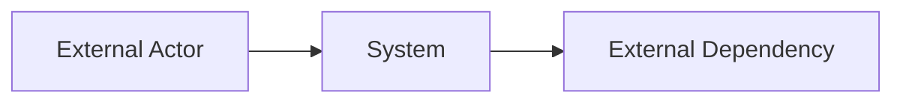
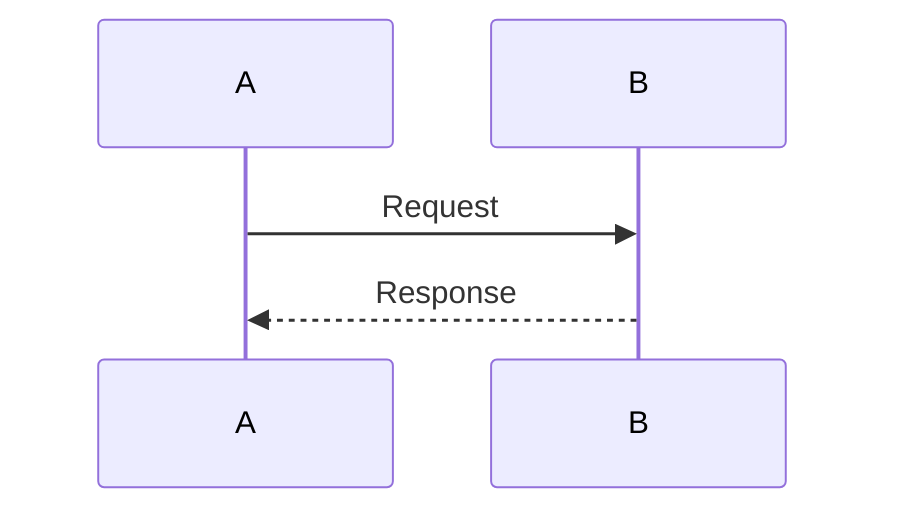
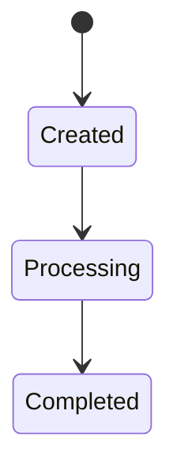

# Architecture Design

Version: <version>
Status: DRAFT / IN_REVIEW / APPROVED / SUPERSEDED
Owner: <Architect>
Related Feature: <F#>
Related Spec: <path>
Last Updated: <YYYY-MM-DD>

---

## 1. Purpose

What architecture problem does this design solve?

```text
<purpose>
```

---

## 2. Architecture Summary

Short summary of the design.

```text
<summary>
```

---

## 3. Conceptual Map

Use this section to describe the system in a pure-text conceptual map before detailed architecture.

Example:

```text
Capability
  → Runtime Context
  → Data Input
  → Processing
  → Result
  → Verification
```

Project-specific map:

```text
<map>
```

---

## 4. C4 Level 1 — System Context

Describe external actors and systems.

```text
User / External System
  → Target System
  → External Dependencies
```

Optional Mermaid:



---

## 5. C4 Level 2 — Container Diagram

Describe major containers / deployable units.

| Container | Responsibility | Technology | Owner |
|---|---|---|---|
|  |  |  |  |

---

## 6. C4 Level 3 — Component Diagram

Describe components inside key containers.

| Component | Responsibility | Depends On | Exposes |
|---|---|---|---|

---

## 7. Critical Sequence / Algorithm Design

Sequence / algorithm is a core design view, not optional.

### Trigger

```text
<what starts the flow>
```

### Input

```text
<input>
```

### Step-by-step Sequence

```text
1.
2.
3.
```

### Branching Conditions

| Condition | Path |
|---|---|

### Error Paths

| Error | Handling | Recovery |
|---|---|---|

### Output

```text
<output>
```

### Metrics / Trace Emitted

```text
<signals>
```

Optional Mermaid:



---

## 8. State Machine

| State | Meaning | Next States |
|---|---|---|

Optional Mermaid:



---

## 9. Data Flow

```text
Source
  → Processor
  → Storage
  → Consumer
```

---

## 10. Architecture Rules

This implementation must:

```text
1.
2.
3.
```

---

## 11. Architecture Anti-Patterns

This implementation must not:

```text
1. Bypass approved runtime contract
2. Directly depend on physical storage tables outside approved repositories
3. Introduce hidden coupling
4. Use deprecated / legacy models
5. Skip validation / idempotency / trace
```

---

## 12. Non-Functional Requirements

| Area | Requirement |
|---|---|
| Performance |  |
| Scalability |  |
| Reliability |  |
| Security |  |
| Observability |  |

---

## 13. Alternatives Considered

| Option | Pros | Cons | Decision |
|---|---|---|---|

---

## 14. Risks

| Risk | Impact | Mitigation |
|---|---|---|

---

## 15. Decision

Decision:

```text
<approved design>
```

Approver:

```text
<name>
```

---

## 16. Change Log

| Date | Change | Owner |
|---|---|---|
