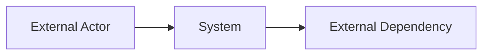
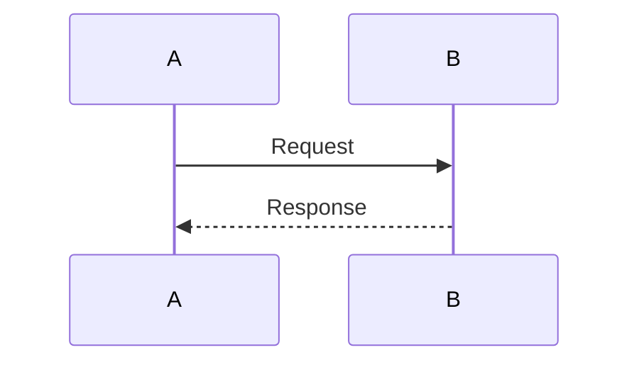
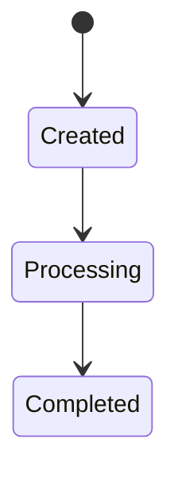

# Generic Product / Project Development Templates v1.3 Complete

This merged file contains all templates from the v1.3 Complete package.


---

# File: 00_README.md

# Generic Product / Project Development Templates


## v1.3 Complete Update

This package is the complete generic product/project development template set. It includes all v1.2 workflow templates plus the upgraded v1.3 implementation-ready Feature / Functional Spec template and Claude Code Generate Spec prompt.

Key v1.3 spec upgrades:

- Controlled Canary / Delivery Slice
- Blocking Open Questions classification
- Key Decisions
- Runtime Sequence / Algorithm
- State Machine
- API / Interface Contract
- Data Model / Schema Contract
- Logical Uniqueness / Idempotency
- Error / Reason Codes
- Acceptance Metrics
- Test / Regression Mapping
- Architecture Impact
- Implementation Readiness Gate


Version: v1.3 Complete
Status: Generic template package
Purpose: Support AI-assisted product/project development from idea to release.

---

## 1. What This Template Package Is

This package provides a reusable documentation and workflow system for product / software project development.

It is not tied to any specific project.

It supports the following flow:

```text
Idea
  → Project Scope / Capability Baseline
  → Feature / Functional Spec
  → Architecture Design
  → Acceptance Criteria
  → Test / Regression Plan
  → Issue / Implementation Plan
  → PR Review / Evidence
  → Release Go / No-Go
  → Change Control
```

---

## 2. Template Usage Flow

Use the templates in this order:

| Step | Purpose | Template |
|---|---|---|
| 1 | Define project scope and capability priorities | `01_project_scope_capability_baseline_template.md` |
| 2 | Create spec index | `02_spec_index_template.md` |
| 3 | Write feature / functional specs | `03_feature_spec_template.md` |
| 4 | Generate acceptance criteria | `04_acceptance_criteria_template.md` |
| 5 | Create architecture design for architecture-sensitive features | `06_architecture_design_template_c4_sequence_algorithm.md` |
| 6 | Define APIs, if needed | `07_api_spec_template.md` |
| 7 | Define data model / schema, if needed | `08_data_model_schema_template.md` |
| 8 | Define test / regression plan | `09_test_plan_regression_template.md` |
| 9 | Record major architecture decisions | `10_adr_template.md` |
| 10 | Create 4hr implementation issues | `11_issue_template.md` |
| 11 | Review PR using evidence-based review | `12_pr_review_acceptance_template.md` |
| 12 | Produce traceability / evidence matrix | `18_test_traceability_matrix_template.md`, `19_claude_code_generate_evidence_matrix_prompt.md` |
| 13 | Make release decision | `20_release_readiness_go_no_go_template.md` |
| 14 | Handle scope/spec/design changes | `change-control/` templates |

---

## 3. Minimum Required Documents by Stage

| Stage | Required Documents |
|---|---|
| Before implementation | Feature Spec, Acceptance Criteria, Issue |
| Before architecture-sensitive implementation | Architecture Design, ADR if major |
| Before engineer acceptance | Acceptance Criteria, Test Traceability Matrix, Evidence Matrix |
| Before release / controlled canary | Release Go / No-Go, Regression Evidence, Rollback Plan |
| Before changing scope/spec/design | Change Note or FCR/SCR/DCR |

---

## 4. Lightweight vs Full Process

Default mode should be lightweight.

```text
Small implementation detail → PR Note
Medium spec/design/test change → Change Note
Major scope/spec/architecture/release change → FCR / SCR / DCR
```

Do not require heavy templates for every small change.

---

## 5. Version and Filename Strategy

When applying these templates to a project:

```text
Use stable active filenames.
Put version in document metadata.
Archive old versions separately.
```

Recommended:

```text
project-scope-capability-baseline.md
spec-index.md
feature-name-spec.md
release-go-no-go.md
```

Avoid active filenames like:

```text
feature-name-spec-v1.3 Complete.md
```

Use archive folder for historical versions:

```text
archive/v1.3 Complete/
```

---

## 6. Recommended Repo Layout

```text
doc/
  project_doc/
    templates/
      <generic templates>

    <project-name>/
      product/
      spec/
      architecture/
      assessment/
      process/
      release/
      tests/
      evidence/
```

---

## 7. AI / Claude Code Usage

Claude Code can help generate:

```text
1. Spec drafts from Feature Baseline + Architecture
2. Acceptance criteria from Spec
3. Regression cases from Acceptance Criteria
4. 4hr issues from approved Spec
5. Architecture drift review
6. Evidence matrix from code/test results
```

Claude Code should not directly decide acceptance.

Engineer sign-off is required for `ACCEPTED`.


---

# File: PACKAGE_CHANGELOG.md

# Package Changelog

## v1.3 Complete

This version combines the generic product/project template package with the upgraded v1.3 spec template.

### Updated

- `03_feature_spec_template.md` upgraded to v1.3 implementation-ready structure.
- `16_claude_code_generate_spec_prompt.md` upgraded to generate specs with blocking decisions, runtime sequence, API/schema contracts, acceptance metrics, test mapping, and implementation readiness gate.

### Included

- Project Scope / Capability Baseline
- Spec Index
- Feature / Functional Spec
- Acceptance Criteria
- Architecture Design with C4 + Conceptual Map + Sequence / Algorithm
- API Spec
- Data Model / Schema
- Test / Regression Plan
- ADR
- Issue Template
- PR Review / Acceptance
- Change Log
- Document Workflow
- Claude Code prompts
- Test Traceability Matrix
- Evidence Matrix
- Release Readiness / Go-No-Go
- Change Control templates


---

# File: 01_project_scope_capability_baseline_template.md

# Project Scope / Capability Baseline

Version: <version>
Status: DRAFT / BASELINE_CANDIDATE / APPROVED_FOR_SPEC_GENERATION
Owner: <Tech Lead / Product Owner>
Last Updated: <YYYY-MM-DD>

---

## 1. Purpose

This document defines the project scope and capability baseline.

It answers:

```text
1. What capabilities are in scope?
2. Which capabilities are required for the first launch / canary?
3. Which capabilities can be deferred?
4. What is the minimum acceptance bar?
5. What specs, tests, and evidence must be created later?
```

This document is **not** a detailed spec, architecture design, or issue list.

---

## 2. Project Goal

Describe the project in one paragraph.

```text
<What outcome should this project deliver?>
```

---

## 3. One-Sentence System / Product Description

```text
<One sentence description of the product/project capability.>
```

---

## 4. Scope Principle

Example:

```text
Month-1 target is controlled canary vertical slice, not full platform coverage.
```

Define the scope principle:

```text
<scope principle>
```

---

## 5. M1 Must Interpretation

M1 Must means this capability must support the approved first-release / controlled canary vertical slice.

It does **not** necessarily mean full platform coverage.

Examples:

```text
- Formula support may only need to cover approved golden formulas.
- Data integration may only need to cover approved source-target scenarios.
- Feature flags may only need to support approved canary dimensions.
- Admin UI / full RBAC / approval workflow may be deferred.
```

---

## 6. Priority Definition

| Priority | Meaning | Decision Rule |
|---|---|---|
| M1 Must | Required for first launch / controlled canary | Missing it blocks launch |
| M1 Should | Strongly recommended for first launch | Missing it requires SOP / accepted risk |
| M2 | Needed after canary / before broad rollout | Does not block initial canary |
| M3 | Platform / governance / long-term capability | Deferred |

---

## 7. Capability List

| ID | Capability | Priority | Purpose | User / System Outcome | Launch Need | Owner | Spec Status | Acceptance Status | Related Spec |
|---|---|---|---|---|---|---|---|---|---|
| F1 | <Capability name> | M1 Must | <Why it exists> | <What user/system can do> | <Why needed for launch> | <owner> | NOT_STARTED | NOT_STARTED | <path> |

Suggested statuses:

```text
Spec Status:
NOT_STARTED / DRAFT / IN_REVIEW / APPROVED / IMPLEMENTING / VERIFIED / RELEASED

Acceptance Status:
NOT_STARTED / GENERATED / REVIEWED / ACCEPTED / CONDITIONAL / REJECTED
```

---

## 8. Acceptance Source

For each M1 capability, define where acceptance will come from.

```text
Capability:
- Spec:
- Acceptance Criteria:
- Regression:
- Evidence:
```

Example:

```text
Capability: F1 Example Capability
- Spec: spec/m1/spec-m1-example.md
- Acceptance Criteria: acceptance/ac-example.md
- Regression: regression/golden/example.yaml
- Evidence: evidence/example-evidence-matrix.md
```

---

## 9. Milestone Scope

### M1 Must

```text
<List M1 Must capabilities>
```

### M1 Should

```text
<List M1 Should capabilities>
```

### M2

```text
<List M2 capabilities>
```

### M3

```text
<List M3 capabilities>
```

---

## 10. Minimum Acceptance Criteria

The first launch / controlled canary can proceed only if:

```text
1. <criterion>
2. <criterion>
3. <criterion>
```

---

## 11. Golden Happy Path

```text
<Step 1>
  → <Step 2>
  → <Step 3>
  → <Expected successful result>
```

---

## 12. Golden Failure Paths

```text
1. <Failure scenario> → <Expected result>
2. <Failure scenario> → <Expected result>
```

---

## 13. Required Follow-up Documents

### Required Before Implementation

| Document | Related Capability | Owner | Status |
|---|---|---|---|
| <spec path> | <F#> | <owner> | NOT_STARTED |

### Required Before Engineer Acceptance

| Document | Related Capability | Owner | Status |
|---|---|---|---|

### Required Before Release / Controlled Canary

| Document | Related Capability | Owner | Status |
|---|---|---|---|

### Deferred Documents

| Document | Related Capability | Target Timing |
|---|---|---|

---

## 14. Risks

| Risk | Impact | Trigger | Mitigation | Decision / Action | Owner |
|---|---|---|---|---|---|
| <risk> | <impact> | <trigger> | <mitigation> | <action> | <owner> |

---

## 15. Change Control Rule

Any change to the following requires Feature Change Request:

```text
1. M1 Must / M1 Should / M2 / M3 priority
2. Minimum acceptance criteria
3. Golden happy path / failure path
4. Capability addition / removal
5. Capability deprecation
6. Launch scope or Go / No-Go criteria
```

Small wording changes can be handled with a PR note or Change Note.


---

# File: 02_spec_index_template.md

# Spec Index

Version: <version>
Owner: <Tech Lead / Spec Owner>
Last Updated: <YYYY-MM-DD>

---

## 1. Purpose

This index tracks all specs for this project.

Use it to understand:

```text
1. Which specs exist
2. Which capabilities they map to
3. Which specs are approved
4. Which specs block implementation / acceptance / release
```

---

## 2. Spec Status Definition

```text
NOT_STARTED
DRAFT
IN_REVIEW
APPROVED
IMPLEMENTING
IMPLEMENTED
VERIFIED
RELEASED
DEPRECATED
```

---

## 3. Spec Index Table

| Spec ID | Title | Related Feature | Priority | Owner | Status | Required Before | Related Architecture | Related Acceptance | Last Updated |
|---|---|---|---|---|---|---|---|---|---|
| SPEC-001 | <Spec title> | F1 | M1 Must | <owner> | DRAFT | Implementation | <arch doc> | <acceptance doc> | <date> |

`Required Before` options:

```text
Implementation
Engineer Acceptance
Controlled Canary
Release
```

---

## 4. Blocking Specs

| Spec | Blocking What | Reason | Owner | Target Date |
|---|---|---|---|---|

---

## 5. Change Log

| Date | Change | Owner |
|---|---|---|


---

# File: 03_feature_spec_template.md

# Feature / Functional Spec Template v1.3

Version: v1.3
Template Type: Feature / Functional Spec
Purpose: Convert a project capability or feature baseline item into an implementation-ready product / functional specification.
Usage: Use this template after a feature is confirmed in the project scope / capability baseline and before implementation issues are created.

---

# Spec: <Feature Name>

## 0. Metadata

| Field | Value |
|---|---|
| Spec ID | SPEC-xxx |
| Version | v0.1 |
| Status | DRAFT / IN_REVIEW / APPROVED / IMPLEMENTING / IMPLEMENTED / VERIFIED / RELEASED / DEPRECATED |
| Priority | M1 Must / M1 Should / M2 / M3 |
| Owner |  |
| Reviewers |  |
| Related Capability |  |
| Related Feature Baseline |  |
| Related Architecture |  |
| Related ADR |  |
| Related Acceptance Criteria |  |
| Related Regression / Golden Cases |  |
| Related Issues |  |
| Related PRs |  |
| Last Updated | YYYY-MM-DD |

### Status Rules

```text
DRAFT: Spec is still being written.
IN_REVIEW: Ready for Tech Lead / Architect / Feature Owner / QA review.
APPROVED: Can be used to generate acceptance criteria and implementation issues.
IMPLEMENTING: Implementation is in progress.
IMPLEMENTED: Code is complete, but not yet verified.
VERIFIED: Engineer acceptance and evidence review passed.
RELEASED: Included in a release / controlled canary.
DEPRECATED: No longer active; replaced or removed.
```

---

## 1. Purpose

Describe what this feature does and why it exists.

```text
This feature exists to...
```

---

## 2. Problem

Describe the problem this feature solves.

```text
Without this feature...
```

---

## 3. Controlled Canary / Delivery Slice

Use this section to constrain what is covered in the current delivery window.
For example, M1 Must usually means **approved vertical slice support**, not full platform coverage.

### Included in This Delivery Slice

| Area | Included Scope |
|---|---|
| User / System Scenario |  |
| Supported Inputs |  |
| Supported Outputs |  |
| Supported Runtime Flow |  |
| Supported API / Event |  |
| Supported Data Model |  |
| Supported Formula / Rule / Business Logic |  |
| Supported Route / Operation / Tool / Tenant / Scope |  |
| Supported Happy Path |  |
| Supported Failure Path |  |

### Explicitly Not Included

| Out of Scope | Reason | Target Phase |
|---|---|---|
|  |  | M2 / M3 / Deferred |

---

## 4. Scope

List what this spec covers.

```text
1.
2.
3.
```

---

## 5. Non-Scope

List what this spec explicitly does not cover.

```text
1.
2.
3.
```

---

## 6. Runtime Sequence / Algorithm

This section is required for runtime behavior. Do not rely only on prose.

### Trigger

```text
What starts this flow?
```

### Preconditions

```text
What must be true before this flow starts?
```

### Main Sequence

```text
1.
2.
3.
4.
```

### Branching Rules

| Condition | Behavior | Output / State |
|---|---|---|
|  |  |  |

### Failure Sequence

| Failure Scenario | Expected Behavior | Error / Reason Code | Retryable? |
|---|---|---|---|
|  |  |  | Yes / No |

### Output

```text
What does this flow produce?
```

### Metrics / Trace Emitted

| Event | Metric / Trace | Required? |
|---|---|---|
|  |  | Yes / No |

---

## 7. State Machine, if applicable

Use this section if the feature has lifecycle states.

| State | Meaning | Allowed Next States | Trigger |
|---|---|---|---|
|  |  |  |  |

### Invalid Transitions

| From | To | Expected Behavior | Error / Reason Code |
|---|---|---|---|
|  |  |  |  |

---

## 8. Data Model / Schema Contract

Use this section for data-bearing features. If no schema impact, state `No schema impact`.

### Tables / Entities

| Table / Entity | Purpose |
|---|---|
|  |  |

### Required Fields

| Field | Type | Required | Description | Validation |
|---|---|---|---|---|
|  |  | Yes / No |  |  |

### Logical Uniqueness

| Logical Key | Purpose | Conflict Behavior |
|---|---|---|
|  |  |  |

### Idempotency

| Scenario | Key | Duplicate Behavior | Conflict Behavior |
|---|---|---|---|
|  |  | ignore / return existing / reject / upsert |  |

### Index / Query Pattern

| Query Pattern | Required Index | Volume Risk |
|---|---|---|
|  |  | Low / Medium / High |

### Partition / Retention Readiness

| Field | Purpose | Required Now? |
|---|---|---|
| createdDate / eventDate / collectDate / publishDate / expireDate | future partition / cleanup | Yes / No |

### Migration / Rollback

| Item | Plan |
|---|---|
| Forward Migration |  |
| Rollback / Recovery |  |
| Data Migration |  |
| Compatibility |  |

---

## 9. API / Interface Contract

Use this section for API, service, command, event, message, job, or integration contracts.

### Interface Type

- [ ] REST API
- [ ] gRPC / RPC
- [ ] Event / Message
- [ ] Batch Job
- [ ] Internal Service Method
- [ ] CLI / Tooling
- [ ] Other:

### Request / Input

| Field | Type | Required | Description | Validation |
|---|---|---|---|---|
|  |  | Yes / No |  |  |

### Response / Output

| Field | Type | Required | Description |
|---|---|---|---|
|  |  | Yes / No |  |

### Error Codes

| Code | Condition | Retryable | Client / Operator Action |
|---|---|---|---|
|  |  | Yes / No |  |

### Compatibility Rule

```text
Breaking change:
Backward compatible fields:
Enum compatibility:
Old client behavior:
```

---

## 10. Rules

List product rules, business rules, runtime rules, validation rules, and system rules.

| Rule ID | Rule | Enforcement Point | Failure Behavior |
|---|---|---|---|
| RULE-001 |  | API / Service / DB / Job / Runtime |  |

---

## 11. Error Handling / Reason Codes

| Scenario | Error / Reason Code | Expected Behavior | Affects Final Result? | Affects Publish / Downstream? |
|---|---|---|---|---|
|  |  |  | Yes / No | Yes / No |

---

## 12. Idempotency / Retry / Duplicate Handling

| Scenario | Expected Behavior | Evidence Required |
|---|---|---|
| Same request repeated |  | Unit / Integration / Regression |
| Same logical key with same value |  |  |
| Same logical key with different value |  |  |
| Retry after transient failure |  |  |
| Retry after permanent failure |  |  |

---

## 13. Metrics / Trace

### Metrics

| Metric | Type | Labels | Purpose | Required for Release? |
|---|---|---|---|---|
|  | counter / gauge / histogram |  |  | Yes / No |

### Metric Label Rule

High-cardinality labels should not be used for metrics. Put them in logs or trace instead.

```text
Do not use high-cardinality labels such as requestId, recordId, userId, lotId, traceId, etc., unless explicitly approved.
```

### Trace / Debug

| Trace Item | Required? | Purpose |
|---|---|---|
|  | Yes / No |  |

---

## 14. Feature Flag / Rollback

### Feature Flags

| Flag | Scope | Default | Purpose |
|---|---|---|---|
|  | global / tenant / route / operation / plan / allowlist | off / on |  |

### Rollback

| Scenario | Rollback Action | Validation After Rollback |
|---|---|---|
|  |  |  |

---

## 15. Acceptance Criteria Summary

This is a summary only. Detailed engineer acceptance criteria must be generated into a separate Acceptance Criteria document before implementation starts.

| AC ID | Summary | Detailed AC Document |
|---|---|---|
| AC-001 |  |  |

---

## 16. Acceptance Metrics

Acceptance metrics are the measurable proof that this feature is complete. These should be defined before implementation.

| Metric / Evidence | Target | Evidence Source |
|---|---|---|
| Golden happy path | PASS | Regression report |
| Failure path | PASS | Regression report |
| Feature flag off behavior | PASS | Test / manual evidence |
| Trace availability | PASS | Trace sample |
| Metric availability | PASS | Metrics report / dashboard |

---

## 17. Test / Regression Requirements

| Requirement | Unit Test | Integration Test | Golden Regression | Failure Path | Evidence Required |
|---|---|---|---|---|---|
|  | Yes / No | Yes / No | Yes / No | Yes / No |  |

---

## 18. Architecture Impact

- [ ] No architecture impact
- [ ] Runtime flow
- [ ] Module boundary
- [ ] Data flow
- [ ] Schema / data model
- [ ] API / interface
- [ ] State machine
- [ ] Feature flag / rollback
- [ ] Requires ADR

### Related Architecture Documents

```text
-
```

### Architecture Review Required?

- [ ] No
- [ ] Yes, before implementation
- [ ] Yes, before release

---

## 19. Dependencies

| Dependency | Type | Status | Risk |
|---|---|---|---|
|  | system / service / data / team / feature | ready / not ready / unknown |  |

---

## 20. Open Questions

### Blocking Before Implementation

| ID | Question | Owner | Decision Needed By | Impact |
|---|---|---|---|---|
| OQ-001 |  |  |  |  |

### Can Decide During Implementation

| ID | Question | Owner | Default Assumption | Impact |
|---|---|---|---|---|
| OQ-101 |  |  |  |  |

### Deferred to Later Phase

| ID | Question | Reason for Deferral | Target Phase |
|---|---|---|---|
| OQ-201 |  |  | M2 / M3 |

---

## 21. Key Decisions

| Decision ID | Decision | Reason | Impact | Decided By | Date |
|---|---|---|---|---|---|
| DEC-001 |  |  |  |  | YYYY-MM-DD |

---

## 22. Implementation Readiness Gate

This spec can enter implementation only when:

- [ ] Blocking open questions resolved
- [ ] Key decisions recorded
- [ ] API / interface contract defined, if applicable
- [ ] Data model / schema contract defined, if applicable
- [ ] Runtime sequence defined
- [ ] State machine defined, if applicable
- [ ] Error handling / reason codes defined
- [ ] Idempotency / duplicate behavior defined, if applicable
- [ ] Acceptance criteria generated
- [ ] Test / regression requirements defined
- [ ] Architecture reviewed, if needed
- [ ] Owner assigned
- [ ] Tech Lead approved
- [ ] Architect approved, if needed
- [ ] QA / Release reviewer aware, if release-impacting

Readiness Decision:

- [ ] NOT_READY
- [ ] READY_FOR_ACCEPTANCE_GENERATION
- [ ] READY_FOR_ARCHITECTURE_REVIEW
- [ ] READY_FOR_IMPLEMENTATION

---

## 23. Change Log

| Version | Date | Change | Reason | Owner |
|---|---|---|---|---|
| v0.1 | YYYY-MM-DD | Initial draft |  |  |


---

# File: 04_acceptance_criteria_template.md

# Acceptance Criteria

Version: <version>
Status: DRAFT / IN_REVIEW / APPROVED / VERIFIED
Owner: <QA / Feature Owner>
Related Feature: <F#>
Related Spec: <path>
Last Updated: <YYYY-MM-DD>

---

## 1. Purpose

This document defines how the feature will be accepted.

Feature List decides **what must be accepted**.
Spec decides **what correct behavior means**.
This document defines **the concrete pass/fail criteria**.

---

## 2. Acceptance Type

- [ ] Functional
- [ ] Data
- [ ] API
- [ ] Failure Path
- [ ] Idempotency
- [ ] Performance
- [ ] Metrics / Trace
- [ ] Feature Flag / Rollback
- [ ] Release Gate

---

## 3. Acceptance Criteria

| ID | Given | When | Then | Priority |
|---|---|---|---|---|
| AC-001 | <context> | <action> | <expected result> | Must |

---

## 4. Failure Acceptance

| ID | Failure Scenario | Expected Result | Reason / Error Code |
|---|---|---|---|
| AC-F-001 | <failure> | <expected handling> | <code> |

---

## 5. Data Acceptance

| ID | Data Condition | Expected Storage / Output |
|---|---|---|

---

## 6. Metrics / Trace Acceptance

| ID | Signal | Expected Evidence |
|---|---|---|

---

## 7. Acceptance to Test Mapping

| Acceptance ID | Acceptance Criteria | Unit Test | Integration Test | Regression Test | Evidence |
|---|---|---|---|---|---|
| AC-001 | <criteria> | <test> | <test> | <case> | <link> |

---

## 8. Engineer Verification

| Reviewer | Role | Decision | Comment |
|---|---|---|---|
| <name> | Feature Owner | ACCEPT / CONDITIONAL / REJECT |  |
| <name> | Architect | ACCEPT / CONDITIONAL / REJECT |  |
| <name> | QA / Release | ACCEPT / CONDITIONAL / REJECT |  |

---

## 9. Acceptance Decision

- [ ] ACCEPTED
- [ ] CONDITIONAL_ACCEPT
- [ ] NEEDS_FIX
- [ ] REJECTED
- [ ] DEFERRED

Reason:

```text
<reason>
```


---

# File: 05_claude_code_generate_acceptance_criteria_prompt.md

# Claude Code Prompt — Generate Acceptance Criteria

Use this prompt to generate acceptance criteria from Feature Baseline + Spec.

```text
You are acting as a QA lead and senior engineer.

Task:
Generate formal acceptance criteria for the selected feature.

Inputs:
1. Project Scope / Capability Baseline
2. Related Feature Spec
3. Related Architecture, if available
4. Acceptance Criteria Template

Rules:
1. Do not invent scope beyond the Feature Baseline and Spec.
2. If behavior is unclear, create Open Questions.
3. Generate acceptance criteria in Given / When / Then form.
4. Include happy path, failure path, data validation, idempotency, metrics / trace, feature flag / rollback if relevant.
5. Map each acceptance criterion to a likely test type:
   - unit
   - integration
   - regression
   - manual verification
6. Mark M1 Must criteria clearly.
7. Do not modify code.

Output:
1. Acceptance Criteria document
2. Open Questions
3. Test mapping table
4. Suggested regression cases
```


---

# File: 06_architecture_design_template_c4_sequence_algorithm.md

# Architecture Design

Version: <version>
Status: DRAFT / IN_REVIEW / APPROVED / SUPERSEDED
Owner: <Architect>
Related Feature: <F#>
Related Spec: <path>
Last Updated: <YYYY-MM-DD>

---

## 1. Purpose

What architecture problem does this design solve?

```text
<purpose>
```

---

## 2. Architecture Summary

Short summary of the design.

```text
<summary>
```

---

## 3. Conceptual Map

Use this section to describe the system in a pure-text conceptual map before detailed architecture.

Example:

```text
Capability
  → Runtime Context
  → Data Input
  → Processing
  → Result
  → Verification
```

Project-specific map:

```text
<map>
```

---

## 4. C4 Level 1 — System Context

Describe external actors and systems.

```text
User / External System
  → Target System
  → External Dependencies
```

Optional Mermaid:



---

## 5. C4 Level 2 — Container Diagram

Describe major containers / deployable units.

| Container | Responsibility | Technology | Owner |
|---|---|---|---|
|  |  |  |  |

---

## 6. C4 Level 3 — Component Diagram

Describe components inside key containers.

| Component | Responsibility | Depends On | Exposes |
|---|---|---|---|

---

## 7. Critical Sequence / Algorithm Design

Sequence / algorithm is a core design view, not optional.

### Trigger

```text
<what starts the flow>
```

### Input

```text
<input>
```

### Step-by-step Sequence

```text
1.
2.
3.
```

### Branching Conditions

| Condition | Path |
|---|---|

### Error Paths

| Error | Handling | Recovery |
|---|---|---|

### Output

```text
<output>
```

### Metrics / Trace Emitted

```text
<signals>
```

Optional Mermaid:



---

## 8. State Machine

| State | Meaning | Next States |
|---|---|---|

Optional Mermaid:



---

## 9. Data Flow

```text
Source
  → Processor
  → Storage
  → Consumer
```

---

## 10. Architecture Rules

This implementation must:

```text
1.
2.
3.
```

---

## 11. Architecture Anti-Patterns

This implementation must not:

```text
1. Bypass approved runtime contract
2. Directly depend on physical storage tables outside approved repositories
3. Introduce hidden coupling
4. Use deprecated / legacy models
5. Skip validation / idempotency / trace
```

---

## 12. Non-Functional Requirements

| Area | Requirement |
|---|---|
| Performance |  |
| Scalability |  |
| Reliability |  |
| Security |  |
| Observability |  |

---

## 13. Alternatives Considered

| Option | Pros | Cons | Decision |
|---|---|---|---|

---

## 14. Risks

| Risk | Impact | Mitigation |
|---|---|---|

---

## 15. Decision

Decision:

```text
<approved design>
```

Approver:

```text
<name>
```

---

## 16. Change Log

| Date | Change | Owner |
|---|---|---|


---

# File: 07_api_spec_template.md

# API Spec

Version: <version>
Status: DRAFT / IN_REVIEW / APPROVED
Owner: <API Owner>
Related Feature: <F#>
Related Spec: <path>
Last Updated: <YYYY-MM-DD>

---

## 1. Purpose

```text
<API purpose>
```

---

## 2. Endpoint / Method

```text
METHOD /path
```

or

```text
Service.methodName
```

---

## 3. Request

```json
{}
```

### Request Fields

| Field | Type | Required | Description | Validation |
|---|---|---|---|---|

---

## 4. Response

```json
{}
```

### Response Fields

| Field | Type | Description |
|---|---|---|

---

## 5. Error Codes

| Code | Meaning | Retryable | User Action |
|---|---|---|---|

---

## 6. Idempotency

```text
Idempotency key:
Duplicate request behavior:
Conflict behavior:
Retry behavior:
```

---

## 7. Compatibility

```text
Breaking change: Yes / No
Existing clients affected: Yes / No
Optional fields only: Yes / No
Enum values backward-compatible: Yes / No
```

---

## 8. Security / Authorization

```text
<auth rules>
```

---

## 9. Metrics / Trace

```text
<metrics and trace>
```

---

## 10. Test Cases

| Case | Input | Expected Output |
|---|---|---|

---

## 11. Change Log

| Date | Change | Owner |
|---|---|---|


---

# File: 08_data_model_schema_template.md

# Data Model / Schema Spec

Version: <version>
Status: DRAFT / IN_REVIEW / APPROVED
Owner: <Data Owner>
Related Feature: <F#>
Related Spec: <path>
Last Updated: <YYYY-MM-DD>

---

## 1. Purpose

```text
<why this model/schema exists>
```

---

## 2. Logical Model

| Entity | Description | Relationships |
|---|---|---|

---

## 3. Physical Schema

### Table / Collection: `<name>`

| Column | Type | Nullable | Default | Description |
|---|---|---|---|---|

---

## 4. Keys and Constraints

```text
Primary key:
Foreign keys:
Check constraints:
Required uniqueness:
```

---

## 5. Index Strategy

| Index | Columns | Purpose | Risk |
|---|---|---|---|

---

## 6. Idempotency / Uniqueness

```text
Idempotency key:
Logical unique key:
Duplicate behavior:
Conflict behavior:
```

---

## 7. Partition / Retention Readiness

```text
Partition-ready date columns:
Retention policy:
Cleanup strategy:
High-volume warning:
```

---

## 8. Migration Plan

```text
Forward migration:
Backfill:
Validation:
Deployment order:
```

---

## 9. Rollback / Recovery Plan

```text
Rollback SQL:
Recovery strategy:
Data compatibility:
```

---

## 10. Data Quality Rules

| Rule | Description | Failure Handling |
|---|---|---|

---

## 11. Test Plan

```text
DDL test:
Repository test:
Migration test:
Rollback test:
```

---

## 12. Change Log

| Date | Change | Owner |
|---|---|---|


---

# File: 09_test_plan_regression_template.md

# Test Plan / Regression Plan

Version: <version>
Status: DRAFT / IN_REVIEW / APPROVED / VERIFIED
Owner: <QA / Test Owner>
Related Feature: <F#>
Related Spec: <path>
Last Updated: <YYYY-MM-DD>

---

## 1. Purpose

```text
<test plan purpose>
```

---

## 2. Test Scope

### In Scope

```text
1.
2.
```

### Out of Scope

```text
1.
2.
```

---

## 3. Unit Tests

| Test | Purpose | Expected Result |
|---|---|---|

---

## 4. Integration Tests

| Test | Components | Expected Result |
|---|---|---|

---

## 5. Golden Regression Tests

| Case ID | Scenario | Input | Expected Output |
|---|---|---|---|

---

## 6. Golden Happy Path

```text
<Step 1>
  → <Step 2>
  → <Expected success>
```

---

## 7. Golden Failure Paths

```text
1. <Failure> → <Expected result>
2. <Failure> → <Expected result>
```

---

## 8. Release Gate Tests

| Gate | Required | Evidence |
|---|---|---|

---

## 9. Regression Gate

This feature can be accepted only when:

- [ ] Required golden cases pass
- [ ] Failure cases pass
- [ ] CI report is attached
- [ ] Evidence matrix updated
- [ ] Engineer sign-off completed

---

## 10. Test Data

```text
<test data source / fixtures>
```

---

## 11. Automation Status

| Test | Automated? | CI Link | Owner |
|---|---|---|---|

---

## 12. Change Log

| Date | Change | Owner |
|---|---|---|


---

# File: 10_adr_template.md

# ADR-XXX: <Decision Title>

Status: Proposed / Accepted / Superseded
Date: <YYYY-MM-DD>
Owner: <Architect>
Related Feature: <F#>
Related Spec: <path>
Related Issues: <links>

---

## 1. Context

What problem or decision context led to this ADR?

---

## 2. Decision

What decision was made?

---

## 3. Alternatives Considered

| Option | Pros | Cons |
|---|---|---|

---

## 4. Consequences

### Positive

```text
<benefits>
```

### Negative / Trade-offs

```text
<trade-offs>
```

---

## 5. Scope Impact

| Area | Impact |
|---|---|
| Feature List | Yes / No |
| Spec | Yes / No |
| Architecture | Yes / No |
| Issue Queue | Yes / No |
| Regression | Yes / No |
| Release Gate | Yes / No |

---

## 6. Follow-up

- [ ] Update Feature Baseline
- [ ] Update Spec
- [ ] Update Architecture
- [ ] Update Acceptance Criteria
- [ ] Update Regression
- [ ] Create Issues

---

## 7. Change Log

| Date | Change | Owner |
|---|---|---|


---

# File: 11_issue_template.md

# Issue: <Title>

Type: Feature / Bug / Refactor / Test / Doc
Priority: P0 / P1 / P2 / P3
Owner: <name>
Target Sprint: <sprint>
Status: TODO / IN_PROGRESS / REVIEW / DONE

---

## 1. Related Documents

Feature:
Spec:
Acceptance Criteria:
Architecture:
Test Plan:
ADR:

---

## 2. Problem

```text
<problem>
```

---

## 3. Goal

```text
<goal>
```

---

## 4. Scope

```text
1.
2.
3.
```

---

## 5. Non-Scope

```text
1.
2.
3.
```

---

## 6. Sizing Check

Expected size:

- [ ] <= 4hr
- [ ] > 4hr, must split

Why this is <= 4hr:

```text
<explanation>
```

---

## 7. Dependencies

```text
<dependencies>
```

---

## 8. Ready for Implementation

- [ ] Feature is in scope
- [ ] Spec approved
- [ ] Acceptance criteria generated
- [ ] Architecture reviewed if needed
- [ ] Dependencies clear
- [ ] Test expectation clear
- [ ] Change control not required or completed

---

## 9. Implementation Plan

```text
1.
2.
3.
```

---

## 10. Acceptance Criteria

```text
<link to acceptance criteria or summary>
```

---

## 11. Test Expectation

- [ ] Unit test
- [ ] Integration test
- [ ] Regression case
- [ ] Manual verification
- [ ] Evidence matrix update

---

## 12. Risk

| Risk | Mitigation |
|---|---|

---

## 13. Done Definition

- [ ] Code implemented
- [ ] Tests pass
- [ ] PR reviewed
- [ ] Evidence attached
- [ ] Spec updated if behavior changed
- [ ] Acceptance status updated


---

# File: 12_pr_review_acceptance_template.md

# PR Review / Acceptance Template

PR:
Related Issue:
Related Spec:
Related Acceptance Criteria:
Owner:
Reviewer:

---

## 1. Review Mode

- [ ] Evidence-based review
- [ ] Architecture boundary review
- [ ] Spec alignment review
- [ ] Cross-context AI review
- [ ] Cross-model review, if high risk
- [ ] Manual line review required

---

## 2. Spec Alignment

- [ ] PR matches approved spec
- [ ] No unapproved behavior change
- [ ] Acceptance criteria addressed
- [ ] Failure cases addressed

---

## 3. Architecture Boundary

- [ ] Does not bypass approved runtime contract / boundary
- [ ] Does not directly use physical storage outside approved repository
- [ ] Does not use legacy / deprecated models
- [ ] Does not introduce hidden coupling
- [ ] Preserves idempotency / validation / trace

---

## 4. Manual Line Review Required If

- [ ] Concurrency / locking
- [ ] DB migration
- [ ] Security / permission
- [ ] Formula evaluator / dynamic execution
- [ ] Idempotency
- [ ] Hold / high-impact decision
- [ ] High-volume query
- [ ] Data consistency

If checked, specify reviewed files:

```text
<files>
```

---

## 5. Evidence

- [ ] Unit test result
- [ ] Integration test result
- [ ] Regression result
- [ ] Metrics screenshot / report
- [ ] Trace example
- [ ] Feature flag tested
- [ ] Rollback path verified
- [ ] Evidence matrix updated

Links:

```text
<links>
```

---

## 6. Cross Review

- [ ] Cross-context AI review completed
- [ ] Cross-model review completed, if high risk
- [ ] Engineer reviewed AI findings

---

## 7. Decision

- [ ] APPROVE
- [ ] APPROVE_WITH_RISK
- [ ] REQUEST_CHANGES
- [ ] REJECT

Reason:

```text
<reason>
```

---

## 8. Sign-off

| Reviewer | Role | Decision | Date |
|---|---|---|---|


---

# File: 13_change_log_template.md

# Change Log

Version: <version>
Owner: <owner>
Last Updated: <YYYY-MM-DD>

---

| Date | Change | Type | Feature Impact | Spec Impact | Architecture Impact | Regression Impact | Owner |
|---|---|---|---|---|---|---|---|
| <date> | <change> | FEATURE / SPEC / ARCHITECTURE / API / SCHEMA / TEST / RELEASE / DEPRECATION | Yes / No | Yes / No | Yes / No | Yes / No | <owner> |


---

# File: 14_claude_code_spec_to_issue_prompt.md

# Claude Code Prompt — Split Spec into 4hr Issues

```text
You are acting as a senior engineering lead.

Task:
Split the approved spec into 4hr implementation issues.

Inputs:
1. Approved feature spec
2. Acceptance criteria
3. Architecture design, if available
4. Issue template

Rules:
1. One issue must be one small deliverable.
2. Target size is <= 4hr.
3. If an issue is larger than 4hr, split it.
4. Every issue must include:
   - goal
   - scope
   - non-scope
   - dependencies
   - acceptance criteria
   - test expectation
   - related spec section
5. Do not invent scope beyond the approved spec.
6. Mark dependency order.
7. Identify issues requiring architecture review.

Output:
1. Ordered issue list
2. Dependency map
3. Suggested owners
4. Risks
```


---

# File: 15_document_workflow_template.md

# Documentation Workflow

Version: <version>
Owner: <Tech Lead>
Last Updated: <YYYY-MM-DD>

---

## 1. Purpose

Define when each document is created, who owns it, and which gate it supports.

---

## 2. Document Production Flow

```text
Idea
  → Project Scope / Capability Baseline
  → Spec Index
  → Feature Spec
  → Architecture Design, if needed
  → Acceptance Criteria
  → Test / Regression Plan
  → Issue
  → PR Review / Evidence
  → Release Go / No-Go
```

---

## 3. Document Ownership

| Document | Owner | Reviewers | Required Before |
|---|---|---|---|
| Project Scope / Capability Baseline | Tech Lead / Product | Architect, QA | Spec generation |
| Feature Spec | Feature Owner | Tech Lead, Architect, QA | Implementation |
| Architecture Design | Architect | Tech Lead, Feature Owner | Architecture-sensitive implementation |
| Acceptance Criteria | QA / Feature Owner | Tech Lead, Engineer | Engineer acceptance |
| Test Plan | QA / Engineer | Tech Lead | Release |
| Issue | Feature Owner | Tech Lead | Implementation |
| PR Review / Evidence | Engineer | Reviewer | Merge |
| Release Go / No-Go | Tech Lead / Release Owner | Architect, QA | Release |

---

## 4. Claude Code Involvement

| Step | Claude Code Role |
|---|---|
| Feature → Spec | Generate draft spec |
| Spec → Acceptance | Generate acceptance criteria |
| Spec → Issue | Split into 4hr issues |
| Code → Evidence | Generate evidence matrix |
| Code → Architecture | Detect architecture drift |

---

## 5. Gates

### Before Implementation

- [ ] Feature in scope
- [ ] Spec approved
- [ ] Acceptance criteria generated
- [ ] Architecture reviewed if needed

### Before Engineer Acceptance

- [ ] Implementation complete
- [ ] Test evidence attached
- [ ] Evidence matrix updated
- [ ] Cross-context review completed if needed

### Before Release

- [ ] P0 blockers = 0
- [ ] M1 Must complete or accepted risk
- [ ] Regression pass
- [ ] Feature flag / rollback ready
- [ ] Go / No-Go signed off

---

## 6. Lightweight Rule

Do not require all templates for every small change.

```text
Small change → PR note
Medium change → Change Note
Major change → FCR / SCR / DCR
```


---

# File: 16_claude_code_generate_spec_prompt.md

# Claude Code Prompt — Generate Implementation-Ready Feature Spec v1.3

Use this prompt to generate a feature / functional spec from a project scope / capability baseline and related architecture documents.

---

## Prompt

```text
You are acting as a senior product-minded software architect and specification writer.

Your task is to generate an implementation-ready feature / functional spec using the provided template.

Inputs:
1. Project Scope / Capability Baseline
2. Related capability / feature entry
3. Related architecture document, if available
4. Existing ADRs, if available
5. Existing API / schema docs, if available
6. Existing code maturity assessment, if available

Use this template as the required output structure:
03_feature_spec_template_v1.3.md

Rules:
1. Do not invent scope beyond the Project Scope / Capability Baseline.
2. If something is unclear, write it as an Open Question.
3. Classify Open Questions into:
   - Blocking Before Implementation
   - Can Decide During Implementation
   - Deferred to Later Phase
4. Do not mark the spec as READY_FOR_IMPLEMENTATION if blocking open questions exist.
5. Identify required architecture documents.
6. Identify whether API, schema, state machine, data contract, or feature flag sections are required.
7. Generate key decision candidates, but do not pretend they are approved decisions.
8. Clearly separate assumptions from decisions.
9. For M1 / canary scope, describe the controlled vertical slice. Do not define full platform coverage unless the baseline explicitly requires it.
10. Include happy path, failure path, idempotency, metrics / trace, and rollback considerations when applicable.
11. Generate acceptance criteria summary only. Detailed acceptance criteria should be generated as a separate document.
12. Generate implementation readiness gate status.

Output:
1. Feature Spec Draft
2. Blocking Open Questions Summary
3. Key Decision Candidates
4. Required Follow-up Documents
5. Implementation Readiness Decision

Do not write code.
Do not create implementation issues yet.
```

---

## Expected Output Files

```text
spec-<feature-name>.md
```

Optional follow-up files:

```text
acceptance/ac-<feature-name>.md
architecture/<feature-name>-architecture.md
regression/<feature-name>-golden-cases.md
```


---

# File: 17_claude_code_architecture_drift_review_prompt.md

# Claude Code Prompt — Architecture Drift Review

```text
You are acting as a senior architect.

Task:
Review the current implementation for architecture drift.

Inputs:
1. Approved architecture design
2. Approved feature spec
3. Current codebase
4. PR diff, if available

Focus on:
1. Bypass of approved runtime contract or boundary
2. Direct access to physical storage outside approved repository
3. Usage of legacy or deprecated models
4. Hidden coupling between modules
5. Incorrect runtime sequence
6. Missing validation / idempotency / trace
7. Unsafe dynamic execution
8. Missing feature flag / rollback path
9. Missing metrics / evidence
10. Divergence from approved C4 / sequence / algorithm design

Output:
1. Architecture Drift List
2. Evidence with file paths
3. Severity: P0 / P1 / P2
4. Impact
5. Recommended fix
6. Whether implementation should pause
```


---

# File: 18_test_traceability_matrix_template.md

# Test Traceability Matrix

Version: <version>
Owner: <QA / Test Owner>
Related Feature:
Related Spec:
Last Updated:

---

## 1. Purpose

Map acceptance criteria to actual tests and evidence.

---

## 2. Matrix

| Acceptance ID | Requirement / Spec Section | Test Type | Test Case | Automation Status | Evidence | Owner |
|---|---|---|---|---|---|---|
| AC-001 | <section> | Unit / Integration / Regression / Manual | <test> | Automated / Manual / Missing | <link> | <owner> |

---

## 3. Coverage Summary

| Category | Total | Covered | Missing |
|---|---:|---:|---:|
| Functional |  |  |  |
| Failure Path |  |  |  |
| Data |  |  |  |
| Metrics / Trace |  |  |  |
| Feature Flag / Rollback |  |  |  |

---

## 4. Missing Test Gaps

| Gap | Impact | Priority | Owner |
|---|---|---|---|


---

# File: 19_claude_code_generate_evidence_matrix_prompt.md

# Claude Code Prompt — Generate Evidence Matrix

```text
You are acting as an engineering verification reviewer.

Task:
Generate an evidence matrix for the selected feature.

Inputs:
1. Feature baseline
2. Related spec
3. Acceptance criteria
4. Test results
5. Current codebase
6. PR diff, if available

Rules:
1. Every claim must include evidence.
2. Use file paths, test names, CI report links, logs, metrics, or trace examples.
3. If evidence is missing, mark MISSING.
4. Do not mark ACCEPTED unless explicit engineer sign-off exists.
5. Do not modify code.

Output table columns:
- Feature
- Spec Section
- Acceptance ID
- Implementation Evidence
- Test Evidence
- Regression Evidence
- Metric / Trace Evidence
- Gap
- Suggested Status
- Engineer Review Required
```


---

# File: 20_release_readiness_go_no_go_template.md

# Release Readiness / Go-No-Go Checklist

Version: <version>
Release ID: <release>
Owner: <Release Owner>
Date: <YYYY-MM-DD>

---

## 1. Release Scope

```text
<release scope>
```

---

## 2. Go / No-Go Decision Table

| Gate | Required | Status | Evidence | Owner |
|---|---|---|---|---|
| P0 blockers = 0 | Yes |  |  |  |
| M1 Must complete | Yes |  |  |  |
| Golden regression pass | Yes |  |  |  |
| Failure path pass | Yes |  |  |  |
| Metrics ready | Yes |  |  |  |
| Trace ready | Yes |  |  |  |
| Feature flag ready | Yes |  |  |  |
| Rollback ready | Yes |  |  |  |
| Engineer sign-off | Yes |  |  |  |

---

## 3. Open Risks

| Risk | Severity | Mitigation | Owner | Accepted? |
|---|---|---|---|---|

---

## 4. Rollback Readiness

- [ ] Feature flag off path verified
- [ ] Config rollback ready
- [ ] Deployment rollback ready
- [ ] DB recovery plan ready
- [ ] Smoke test after rollback defined

---

## 5. Canary Scope

```text
Allowed users / routes / segments / operations:
Excluded scope:
Expansion rule:
Stop rule:
```

---

## 6. Final Decision

- [ ] GO
- [ ] GO_WITH_RISK
- [ ] NO_GO

Reason:

```text
<reason>
```

---

## 7. Sign-off

| Role | Name | Decision | Date |
|---|---|---|---|
| Tech Lead |  |  |  |
| Architect |  |  |  |
| QA / Release |  |  |  |
| Operations |  |  |  |


---

# File: change-control/21_change_note_template.md

# Change Note

Use this for lightweight medium changes.

Version: <version>
Owner: <owner>
Related Issue / PR: <link>
Date: <YYYY-MM-DD>

---

## 1. Change Type

- [ ] Implementation Detail
- [ ] Spec Clarification
- [ ] Design Adjustment
- [ ] API Adjustment
- [ ] Schema Adjustment
- [ ] Test / Regression Update

---

## 2. Summary

```text
<summary>
```

---

## 3. Why

```text
<reason>
```

---

## 4. Impact

| Area | Impact |
|---|---|
| Feature List | Yes / No |
| Spec | Yes / No |
| Architecture | Yes / No |
| API | Yes / No |
| Schema | Yes / No |
| Regression | Yes / No |
| Release Gate | Yes / No |

---

## 5. Decision

- [ ] PR note enough
- [ ] Approved
- [ ] Rejected
- [ ] Need FCR
- [ ] Need SCR
- [ ] Need DCR

Approver:
Date:


---

# File: change-control/22_feature_change_request_template.md

# Feature Change Request

FCR ID:
Type: ADD / CHANGE / DEPRECATE
Status: PROPOSED / UNDER_REVIEW / APPROVED / REJECTED / DEFERRED
Owner:
Request Date:
Target Release:
Related Feature ID:
Related Spec:
Related Architecture:
Related Issues:

---

## 1. Summary

```text
<summary>
```

---

## 2. Change Type

- [ ] ADD new feature
- [ ] CHANGE existing feature
- [ ] DEPRECATE feature

---

## 3. Current State

```text
<current state>
```

---

## 4. Proposed State

```text
<proposed state>
```

---

## 5. Reason

```text
<why>
```

---

## 6. Priority Proposal

- [ ] M1 Must
- [ ] M1 Should
- [ ] M2
- [ ] M3
- [ ] Deferred
- [ ] Reject

Reason:

```text
<reason>
```

---

## 7. Impact Analysis

| Area | Impact |
|---|---|
| Product / Scope |  |
| Spec |  |
| Architecture |  |
| API |  |
| Schema |  |
| Regression |  |
| Release |  |

---

## 8. Risk

| Risk | Impact | Mitigation |
|---|---|---|

---

## 9. Decision

- [ ] Approved
- [ ] Rejected
- [ ] Deferred
- [ ] Need more information

Approver:
Decision Date:

---

## 10. Required Follow-up

- [ ] Update Feature List
- [ ] Update Spec
- [ ] Update Architecture / ADR
- [ ] Update Acceptance Criteria
- [ ] Update Regression
- [ ] Update Issue Queue
- [ ] Update Claude Code Prompt
- [ ] Update Release Gate
- [ ] Create Implementation Issues
- [ ] Create Deprecation Plan


---

# File: change-control/23_spec_change_request_template.md

# Spec Change Request

SCR ID:
Status: PROPOSED / APPROVED / REJECTED / DEFERRED
Owner:
Request Date:
Related Feature:
Related Spec:
Related Architecture:
Related Issues:
Related PRs:

---

## 1. Summary

```text
<summary>
```

---

## 2. Current Spec

```text
<current spec>
```

---

## 3. Proposed Spec

```text
<proposed spec>
```

---

## 4. Reason

```text
<why>
```

---

## 5. Before / After

| Area | Before | After |
|---|---|---|
| Runtime behavior |  |  |
| API |  |  |
| Data model |  |  |
| Error handling |  |  |
| Acceptance criteria |  |  |
| Regression |  |  |

---

## 6. Impact Analysis

### Product Scope Impact

- [ ] No scope change
- [ ] M1 Must affected
- [ ] M1 Should affected
- [ ] M2 / M3 affected
- [ ] Need Feature Change Request

### Architecture Impact

- [ ] No architecture impact
- [ ] Runtime flow
- [ ] Data flow
- [ ] Module boundary
- [ ] Schema
- [ ] API
- [ ] ADR required

### Test Impact

- [ ] Unit test
- [ ] Integration test
- [ ] Golden regression
- [ ] Failure path
- [ ] Acceptance criteria

---

## 7. Decision

- [ ] Approved
- [ ] Rejected
- [ ] Deferred
- [ ] Need more information

Approver:
Decision Date:


---

# File: change-control/24_design_change_request_template.md

# Design Change Request

DCR ID:
Status: PROPOSED / APPROVED / REJECTED / DEFERRED
Owner:
Request Date:
Related Issue:
Related Spec:
Related Architecture:
Related PR:

---

## 1. Problem Found During Implementation

```text
<problem>
```

---

## 2. Evidence

- Code path:
- Failing test:
- Limitation:
- Performance concern:
- Runtime flow conflict:

---

## 3. Current Design

```text
<current design>
```

---

## 4. Proposed Design Change

```text
<proposal>
```

---

## 5. Alternatives Considered

| Option | Pros | Cons |
|---|---|---|

---

## 6. Impact Analysis

| Area | Impact |
|---|---|
| Spec |  |
| Architecture |  |
| API |  |
| Schema |  |
| Regression |  |
| Release Gate |  |

---

## 7. Recommendation

```text
<recommendation>
```

---

## 8. Decision

- [ ] Approved
- [ ] Rejected
- [ ] Deferred
- [ ] Need more information

Approver:
Decision Date:

---

## 9. Follow-up

- [ ] Update architecture document
- [ ] Update ADR
- [ ] Update spec
- [ ] Update issue scope
- [ ] Update tests
- [ ] Update regression


---

# File: change-control/25_feature_deprecation_plan_template.md

# Feature Deprecation Plan

Feature ID:
Feature Name:
Owner:
Deprecation Status: PROPOSED / DEPRECATED / DISABLED / REMOVED
Target Disable Release:
Target Removal Release:

---

## 1. Reason for Deprecation

```text
<reason>
```

---

## 2. Current Usage

- Code:
- Config:
- Tests:
- Regression:
- Runtime:
- Users / Teams:

---

## 3. Replacement / Fallback

```text
<replacement>
```

---

## 4. Compatibility Impact

```text
<impact>
```

---

## 5. Disable Plan

- [ ] Feature flag off
- [ ] Config disabled
- [ ] Stop generating new usage
- [ ] Keep backward read support

---

## 6. Migration Plan

```text
<migration>
```

---

## 7. Regression Update

```text
<tests to remove/update/add>
```

---

## 8. Rollback Plan

```text
<rollback>
```

---

## 9. Final Removal Criteria

```text
1. No active config depends on this feature
2. No runtime usage in last N days
3. Regression updated
4. Replacement verified
5. Release owner sign-off
```

---

## 10. Sign-off

| Role | Name | Status |
|---|---|---|
| Tech Lead |  |  |
| Architect |  |  |
| Feature Owner |  |  |
| QA / Release Owner |  |  |


---

# File: change-control/26_change_control_workflow_template.md

# Change Control Workflow

Version: <version>
Owner: <Tech Lead>
Last Updated: <YYYY-MM-DD>

---

## 1. Purpose

Define how to add, modify, or deprecate project capabilities, specs, and architecture designs.

---

## 2. Lightweight Rule

Do not over-process small changes.

```text
Level 0: PR note
Level 1: Change Note
Level 2: FCR / SCR / DCR
```

---

## 3. Decision Guide

| Change | Required Process |
|---|---|
| Implementation detail only | PR note |
| Small spec clarification | Change Note |
| Small design adjustment | Change Note |
| Add / remove / reprioritize feature | FCR |
| Change functional behavior / acceptance | SCR |
| Change architecture / schema / data flow | DCR |
| Deprecate feature | FCR + Deprecation Plan |

---

## 4. Three Questions

Before escalating, ask:

```text
1. Does this change user/runtime behavior?
2. Does this change architecture/schema/API?
3. Does this affect launch / controlled canary?
```

If all no → PR note.
If one yes but low risk → Change Note.
If high risk → FCR / SCR / DCR.

---

## 5. Approval

| Process | Approver |
|---|---|
| PR note | PR reviewer |
| Change Note | Tech Lead / Architect depending on impact |
| FCR | Tech Lead + Product / Architect if needed |
| SCR | Tech Lead + Spec Owner |
| DCR | Architect + Tech Lead |
| Deprecation Plan | Tech Lead + Architect + QA / Release |

---

## 6. Closure Criteria

A change is closed only when:

- [ ] Baseline / spec / architecture updated if needed
- [ ] Issue queue updated
- [ ] Tests / regression updated
- [ ] Evidence attached
- [ ] Engineer verification completed
- [ ] Release note / changelog updated


---

# File: change-control/27_claude_code_change_impact_analysis_prompt.md

# Claude Code Prompt — Change Impact Analysis

```text
You are acting as a senior tech lead and architect.

Task:
Review this change request and perform impact analysis.

Inputs:
1. Change Note / FCR / SCR / DCR
2. Project Scope / Capability Baseline
3. Related Spec
4. Related Architecture
5. Current Codebase

Return:
1. Impacted capabilities
2. Impacted specs
3. Impacted architecture documents
4. Impacted APIs / schemas
5. Impacted tests / regression
6. Impacted release gates
7. Files likely affected
8. Risk level: Small / Medium / Major
9. Whether this should remain Change Note or be escalated to FCR / SCR / DCR
10. Recommended follow-up issues

Rules:
- Do not modify code.
- Provide evidence with file paths where possible.
- Mark uncertain items explicitly.
```
